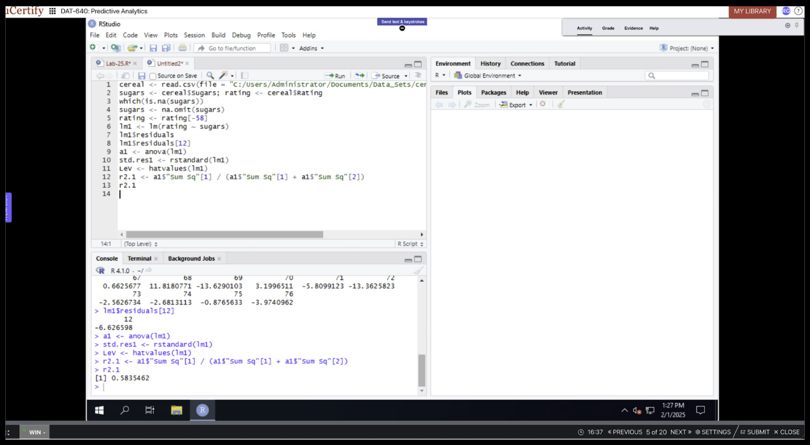

# Interactive Data Visualization and Linear Regression in R

The project is divided into three parts:  
1. Creating interactive data visualizations with R.  
2. Completing applied regression labs.  
3. Reflecting on the benefits, applications, and assumptions of linear regression.  

The code, screenshots, and explanations included here demonstrate how R and its visualization packages can be leveraged to produce dynamic, interpretable insights for data analysis and predictive modeling.

---

## Part 1: Interactive Visualizations

For the interactive visualization portion, I used the **mtcars dataset** in RStudio, a classic dataset that includes characteristics of various car models, such as **miles per gallon (mpg)**, **horsepower (hp)**, and **number of cylinders (cyl)**. To produce the plots, I combined **ggplot2** for structure and design with **plotly** for interactivity.  

### Visualization 1: Interactive Scatterplot  

  
*Figure 1: Scatterplot showing the relationship between miles per gallon (mpg) and horsepower (hp), with cylinder count (cyl) used to color the data points.*

This scatterplot explores the relationship between horsepower and fuel efficiency. By coloring points according to cylinder count, patterns become immediately apparent: cars with more cylinders tend to have higher horsepower but lower mpg. Interactivity enhances this visualization by allowing users to **hover over data points** to see exact values, zoom into specific ranges, and identify outliers.  

**Benefits**:  
- Encourages deeper exploration of variable relationships.  
- Helps highlight trade-offs between fuel efficiency and performance.  
- Useful for identifying clusters or anomalies across categories like cylinder count.  

---

### Visualization 2: Interactive Histogram  

  
*Figure 2: Interactive histogram showing the distribution of miles per gallon (mpg).*

This histogram displays the distribution of mpg across the dataset. With interactivity, users can adjust the bin width in real time, making it possible to explore how different levels of granularity reveal the spread of values.  

**Benefits**:  
- Demonstrates central tendencies and skewness in fuel efficiency.  
- Helps identify ranges where mpg values cluster.  
- Interactivity provides flexibility to uncover new patterns at different bin sizes.  

---

### Visualizations 3 and 4: Histograms with Varying Bin Widths  

  
*Figure 3 and 4: Histogram with bin width of 1.5 (left) compared to bin width of 3 (right).*

These side-by-side histograms compare two bin widths applied to the same dataset. A bin width of **1.5** reveals finer detail, highlighting subtle variations in mpg, while a bin width of **3** smooths the distribution, emphasizing broader trends.  

**Benefits**:  
- Shows how parameter choices (like bin width) affect interpretation.  
- Highlights the importance of customization in visual analysis.  
- Encourages analysts to compare multiple perspectives before drawing conclusions.  

---

## Part 2: Regression Labs

In addition to creating interactive plots, I completed three labs that focused on regression analysis using R. These exercises reinforced key skills for building, evaluating, and diagnosing regression models.

### Visualization 5: Plotting Data with a Regression Line  

  
*Figure 5: Scatterplot with fitted regression line.*

This lab introduced linear regression by plotting a regression line on top of a scatterplot. The line illustrates the estimated relationship between predictor and outcome variables.  

**Benefits**:  
- Demonstrates how regression quantifies relationships.  
- Makes patterns clearer by summarizing data with a simple model.  
- Provides a foundation for prediction and hypothesis testing.  

---

### Visualization 6: Measuring Goodness of Fit  

  
*Figure 6: Output showing R² statistic for model evaluation.*

This lab evaluated regression performance using the **R² statistic**, which measures the proportion of variance in the outcome explained by the model. A higher R² indicates a better fit.  

**Benefits**:  
- Offers a simple way to assess model accuracy.  
- Helps compare competing regression models.  
- Reinforces that a good fit means the model captures meaningful patterns.  

---

### Visualization 7: Verifying Regression Assumptions  

  
*Figure 7: Diagnostic plots checking linear regression assumptions.*

This lab focused on verifying the core assumptions of linear regression (linearity, independence, homoscedasticity, and normality of errors). Diagnostic plots such as residual plots and Q-Q plots were used to assess whether the model met these requirements.  

**Benefits**:  
- Ensures validity of regression results.  
- Highlights potential issues like heteroscedasticity or non-normal residuals.  
- Reinforces that modeling is not just about fit, but also about validity.  

---

## How to Reproduce
- Open the R project in RStudio.  
- Load the `mtcars` dataset.  
- Use `ggplot2` for static plots and `plotly` for interactivity.  
- Adjust histogram bin widths with the `binwidth` parameter.  

---

## Part 3: Reflection on Linear Regression

Linear regression is one of the most widely used and accessible tools in predictive analytics. Its **strength lies in simplicity**: it models the relationship between variables with a clear mathematical equation that can be easily explained and applied. Businesses, policymakers, and researchers value regression for its interpretability—decision-makers can directly see how changes in one factor (e.g., advertising budget, pricing, dosage of medication) affect an outcome (e.g., sales, customer demand, recovery rates).  

In predictive analytics, regression allows us to both **understand drivers of outcomes** and **forecast future values**. For example, sales teams can estimate how revenue might grow with increased marketing spend, or environmental scientists can project the effects of temperature increases on crop yields. This dual role—as both an explanatory and predictive tool—makes regression a cornerstone of analytics.  

That said, regression is not universally applicable. It assumes linear relationships, independence of observations, constant error variance, and normally distributed errors. If these conditions are violated, results may be misleading. For instance, if residuals show heteroscedasticity (unequal variance), statistical tests may overstate significance. If predictors are highly correlated (multicollinearity), it becomes difficult to separate their individual effects.  

Checking assumptions through diagnostic tools is therefore essential. Residual plots, histograms of residuals, and Q-Q plots reveal whether the model is robust. When assumptions hold, regression is a **powerful method for prediction and insight**. When they don’t, alternative approaches—such as polynomial regression, generalized linear models, or nonparametric methods—may be required.  

**In summary**: Linear regression is both a practical and insightful technique. It provides clarity, interpretability, and actionable insights, but only when applied carefully. By combining predictive power with transparency, it helps transform raw data into evidence that can guide strategy, highlight key variables, and build confidence in data-driven decisions.

---

## Summary

This project demonstrated the versatility of R for both interactive visualization and regression modeling:  

- **Interactive Visualizations**: Using ggplot2 + plotly, I created scatterplots and histograms that engage users, enabling real-time exploration and deeper understanding of data.  
- **Regression Labs**: Through lab exercises, I learned how to build models, assess goodness of fit, and verify assumptions, ensuring reliability.  
- **Reflection**: I explored the broader significance of linear regression in predictive analytics, emphasizing both its strengths and its limitations.  

The combination of **hands-on coding, interactive tools, and theoretical reflection** highlights how analytics is both a technical and interpretive discipline.  

---

## Skills Demonstrated
- Interactive visualization in R using **ggplot2** and **plotly**  
- Exploratory data analysis on multivariate datasets  
- Evaluating regression models with **R²** and diagnostics  
- Communicating insights through professional documentation  

